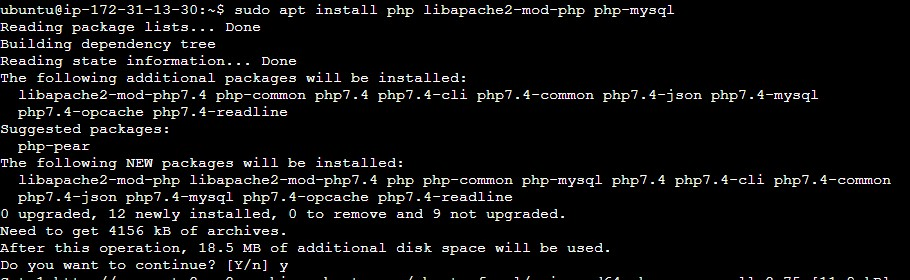

### Project-1 Documentation

## Step 1

**Download Updates for Ubuntu**

`sudo apt update`

**Install Apache on Ubuntu**

`sudo apt install apache2`

**Check Apache status**

`sudo systemctl status apache2`

- [Install OpenSSH](https://learn.microsoft.com/en-us/windows-server/administration/openssh/openssh_install_firstuse?tabs=powershell#install-openssh-for-windows)

- [OpenSSH Key Management](https://learn.microsoft.com/en-us/windows-server/administration/openssh/openssh_keymanagement#user-key-generation)

- [Adding port 80 to the inbound rule of an EC2 instance](https://aws.amazon.com/premiumsupport/knowledge-center/connect-http-https-ec2/)

## Step 2    

**Install Mysql**

`sudo apt install mysql-server`

**Login to  Mysql**

`sudo mysql`

**Remove insecure default security settings**

`ALTER USER 'root'@'localhost' IDENTIFIED WITH mysql_native_password BY 'PassWord.1';`

**Start interactive script running**

`sudo mysql_secure_installation`

**Test log in to Mysql console**

`sudo mysql -p`

## Step 3   

**Install PHP**

`sudo apt install php libapache2-mod-php php-mysql`

`php -v`

## Step 4

**Creating a virtual host for your websit using Apache**

`sudo mkdir /var/www/projectlamp`
`sudo chown -R $USER:$USER /var/www/projectlamp`
`sudo vi /etc/apache2/sites-available/projectlamp.conf`
`sudo ls /etc/apache2/sites-available`
`sudo a2ensite projectlamp`
`sudo a2dissite 000-default`
`sudo apache2ctl configtest`
`sudo systemctl reload apache2`

## Step 5

**Enable PHP on the website**

`sudo vim /etc/apache2/mods-enabled/dir.conf`

`sudo systemctl reload apache2`

`vim /var/www/projectlamp/index.php`

